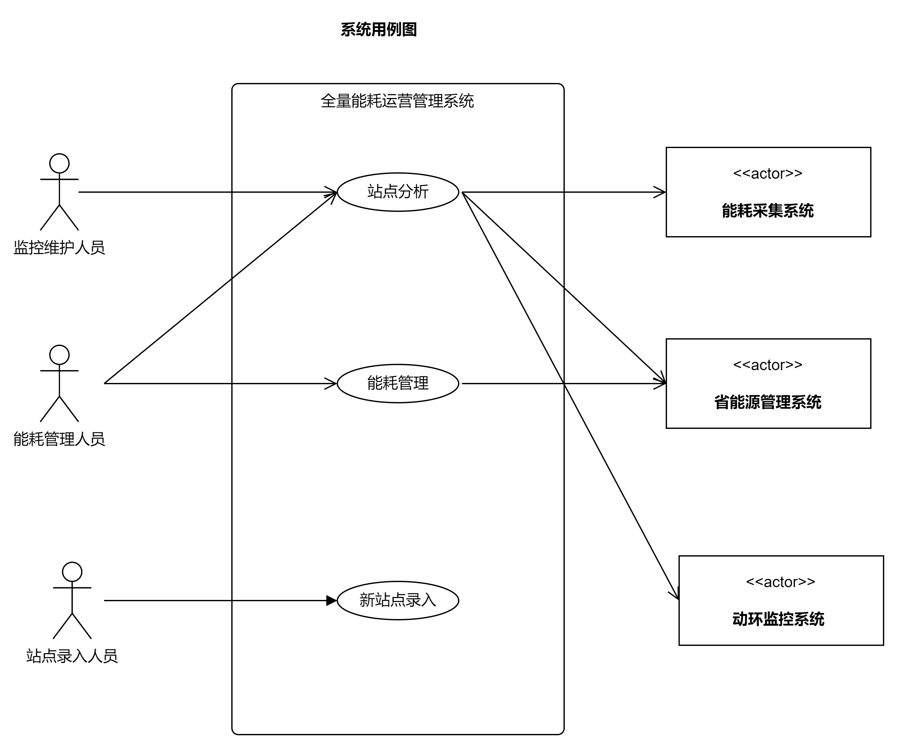

# 全量能耗运营管理系统场景用例(详细)

---

## 场景用例UC1: 站点分析 (PUE 能耗 高温)

### 级别: 用户目标

### 主要参与者: 能耗管理人员

### 涉众及其关注点:

- __能耗管理人员__: 希望能分析该站点能耗总体情况及变化趋势, 掌握生产/经营/办公电费的分摊数据, 为能耗压降工作提供数据支撑.
- __监控维护人员__: 希望能分析该站点PUE及高温情况, 制定相应的温度控制方案.

### 基本流程

1. 显示最后报账月的电费, 电量, 单价, 能源系统预警信息
2. 显示最后报账月的生产, 经营, 办公电费分摊数据
3. 显示最近一年的报账电费/电量变化图表
4. 准实时显示当前PUE数据(1小时更新1次?)
5. 显示当天PUE数据变化图表
6. 显示站点的管理信息(站点类型/供电类型/房长/联系电话)
7. 显示站点温湿度及空调运行状态

### 扩展:

---

## 场景用例UC2: 能耗管理

### 级别: 用户目标

### 主要参与者: 能耗管理人员

### 涉众及其关注点:

- __能耗管理人员__: 希望能测算各站点真实的一级能耗分摊情况.能统计各单位真正的生产/经营/办公用电数据, 作为管理调度的依据.

### 基本流程

1. 显示各站点的一级分摊报表
2. 显示各单位的一级分摊统计报表

### 扩展:

---

## 场景用例UC3: 新建采集点的配置录入

### 级别: 用户目标

### 主要参与者: 新增站点的录入人员

### 涉众及其关注点

- __新增站点的录入人员__: 希望在新站点安装完成后, 将采集配置数据录入系统中.

### 基本流程

1. 录入站点名称（与能源系统名称的对应关系）
2. 录入站点采集位置
3. 录入一级分摊和PUE的计算方法

### 扩展:
